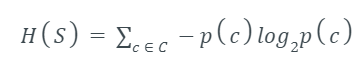
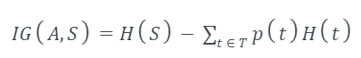
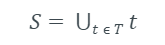

## Iterative Dichotomiser 3

ID3 algorithm, stands for Iterative Dichotomiser 3, is a classification algorithm that follows a greedy approach of building a decision tree by selecting a best attribute that yields maximum Information Gain (IG) or minimum Entropy (H).

Entropy is a measure of the amount of uncertainty in the dataset S. Mathematical Representation of Entropy is shown here -

Where,

- S - The current dataset for which entropy is being calculated(changes every iteration of the ID3 algorithm).
- C - Set of classes in S {example - C ={yes, no}}
- p(c) - The proportion of the number of elements in class c to the number of elements in set S.

In ID3, entropy is calculated for each remaining attribute. The attribute with the smallest entropy is used to split the set S on that particular iteration.

Entropy = 0 implies it is of pure class, that means all are of same category.

----------------------------------------------------------------------

Information Gain IG(A) tells us how much uncertainty in S was reduced after splitting set S on attribute A. Mathematical representation of Information gain is shown here -

Where,

- H(S) - Entropy of set S.
- T - The subsets created from splitting set S by attribute A such that

     
- p(t) - The proportion of the number of elements in t to the number of elements in set S.
- H(t) - Entropy of subset t.

In ID3, information gain can be calculated (instead of entropy) for each remaining attribute. The attribute with the largest information gain is used to split the set S on that particular iteration.

The steps in ID3 algorithm are as follows:

- Calculate entropy for dataset.
- For each attribute/feature.
  - Calculate entropy for all its categorical values.
  - Calculate information gain for the feature.
- Find the feature with maximum information gain.
- Repeat it until we get the desired tree.
